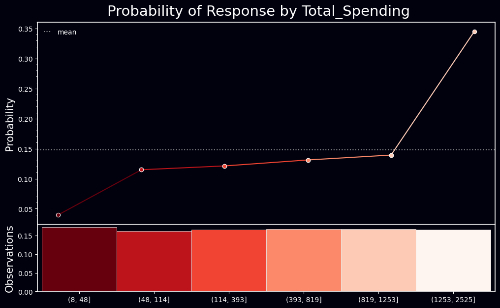
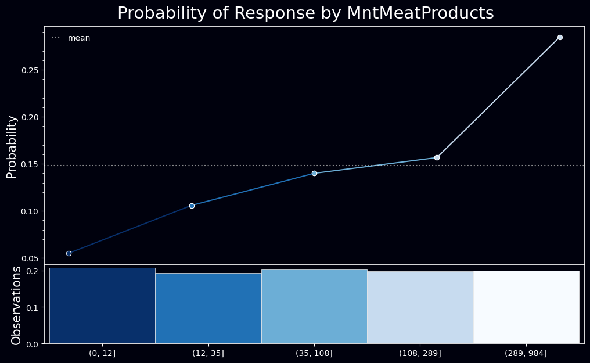
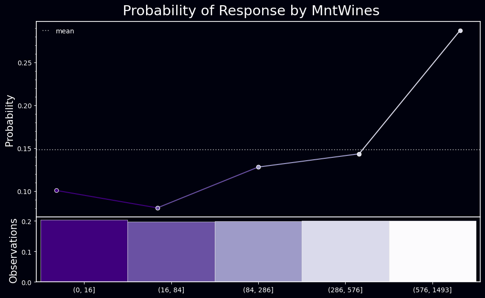
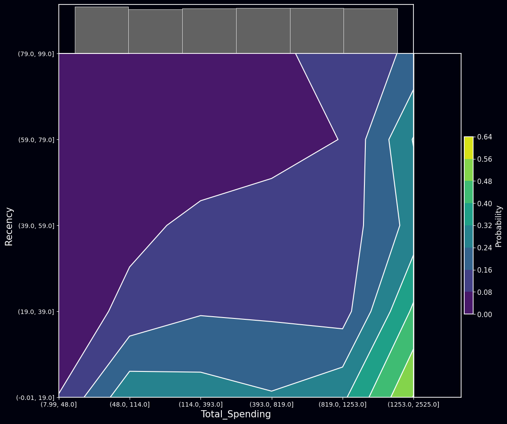
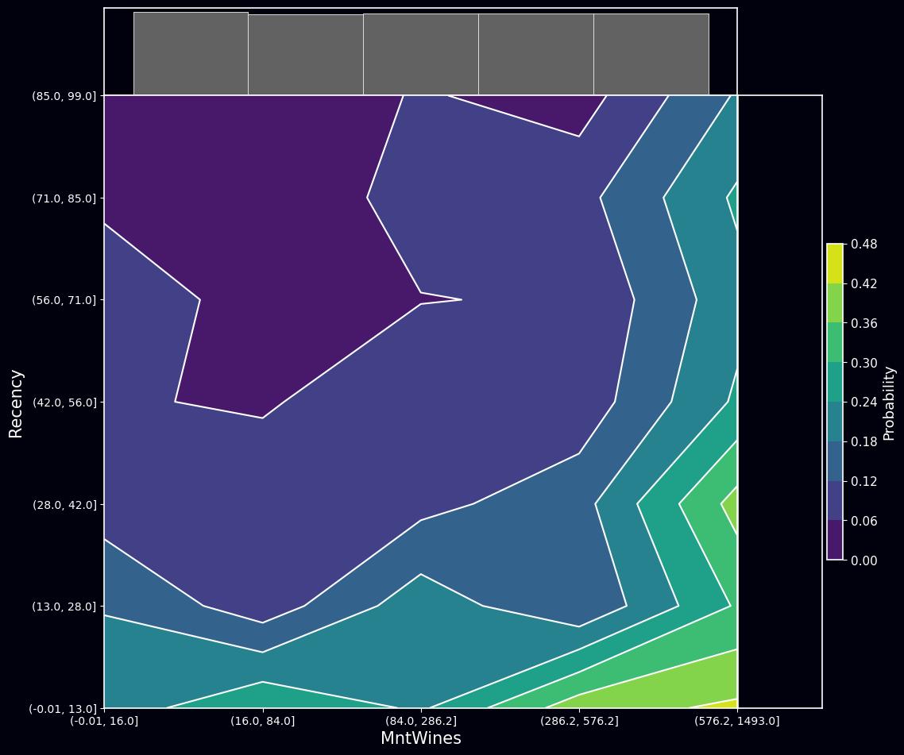
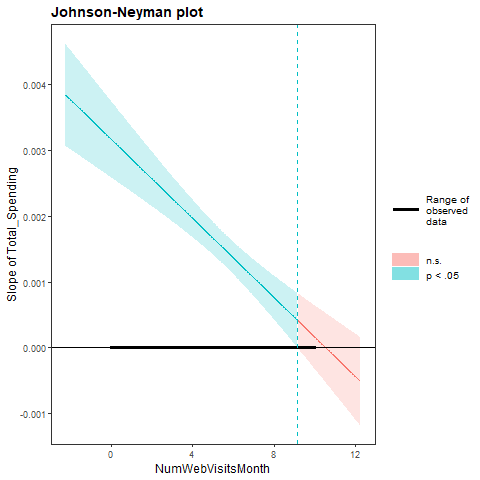

## Executive Summary

In the evolving e-commerce landscape, the understanding of customer behavior has been recognized as paramount. A comprehensive analysis of marketing campaign data has been conducted to offer insights into the factors influencing customer responses to campaigns. The emphasis has been placed on variables such as spending habits, purchase recency, and website visit frequency. The findings have revealed:

1.  A positive relationship between the frequency of web visits and a customer's response was observed. However, this relationship has been nuanced by the total spending of the customer, emphasizing the necessity to approach customer behavior with a holistic perspective.
2.  The diminishing effect of total spending with increased web visits suggests a complex interaction between engagement and expenditure.
3.  A model, deemed reliable through metrics such as AIC, PCP, and Tjur's R2, has been used to validate the insights.

From a strategic viewpoint, businesses are advised not only to drive web traffic but also to ensure that these visits lead to meaningful engagements and purchases.

## 1. Introduction

The advent of the digital age has ushered in a renewed understanding of consumer behavior. As a significant majority of transactions have transitioned online, the need to discern what drives a customer to respond to a campaign or finalize a purchase has become paramount.

In this report, a detailed exploration into the intricacies of customer responses has been undertaken. Insights have been drawn from a comprehensive dataset that encapsulates various facets of customer behavior. Through the exploratory data analysis, influential factors have been highlighted, new perspectives on traditionally overlooked variables have been presented, and a nuanced relationship between website engagement and spending has been showcased.

As the report is navigated, the complexities of customer behavior, the interplay between various influential factors, and recommendations on how these insights can be harnessed by businesses for optimized marketing campaigns will be revealed.

## 2. Technical Setup

### Python

<details>
<summary>Code</summary>

``` python
#data processing
import numpy as np
import pandas as pd
import os
import datetime
import math
import functools
from datetime import datetime
import scipy.stats as stats
from scipy.stats import pointbiserialr
from scipy.stats import chi2_contingency


import plotly.graph_objects as go
import plotly.express as px
import plotly.figure_factory as ff
from plotly.subplots import make_subplots

import sys
sys.path.append(r"D:\Project\rpy2_testing\src")
import my_utils

import warnings
warnings.filterwarnings('ignore')
```

</details>

### R

<details>
<summary>Code</summary>

``` python
os.environ['R_HOME'] = 'C:/Program Files/R/R-4.3.1'  
```

</details>
<details>
<summary>Code</summary>

``` python
# import rpy2's package module
from rpy2.robjects.packages import importr
from functools import partial
import rpy2.robjects.packages as rpackages
from rpy2.robjects.vectors import StrVector
from rpy2.ipython import html
html.html_rdataframe=partial(html.html_rdataframe, table_class="docutils")
```

</details>
<details>
<summary>Code</summary>

``` python
#RUn to install R packages if not installed yet
utils = importr('utils')
base = importr('base')

# select a mirror for R packages
utils.chooseCRANmirror(ind=1) # select the first mirror in the list

# R package names
packnames = ('peformance', 'tidyr')


# Selectively install what needs to be install.
names_to_install = [x for x in packnames if not rpackages.isinstalled(x)]
if len(names_to_install) > 0:
    utils.install_packages(StrVector(names_to_install))
```

</details>
<details>
<summary>Code</summary>

``` python
%load_ext rpy2.ipython
```

</details>
<details>
<summary>Code</summary>

``` python
%%R
library(dplyr)
library(ggplot2)
library(ggstatsplot)
library(gridExtra)
library(kableExtra)
library(ggthemr)
library(summarytools)
```

</details>

## 3. Data Collection, Understanding, and Preparation

### 3.1. Data Collection

<details>
<summary>Code</summary>

``` python
df_raw = pd.read_csv('data\marketing_campaign.csv', sep='\t')
```

</details>

### 3.2. Data Understanding

<details>
<summary>Code</summary>

``` python
my_utils.dataframe_info(df_raw)
```

</details>
<div>
<style scoped>
    .dataframe tbody tr th:only-of-type {
        vertical-align: middle;
    }

    .dataframe tbody tr th {
        vertical-align: top;
    }

    .dataframe thead th {
        text-align: right;
    }
</style>
<table border="1" class="dataframe">
  <thead>
    <tr style="text-align: right;">
      <th></th>
      <th>Column</th>
      <th>Data Type</th>
      <th>Unique Count</th>
      <th>Unique Sample</th>
      <th>Missing Values</th>
      <th>Missing Percentage</th>
    </tr>
  </thead>
  <tbody>
    <tr>
      <th>0</th>
      <td>ID</td>
      <td>int64</td>
      <td>2240</td>
      <td>[5524, 2174, 4141, 6182, 5324]</td>
      <td>0</td>
      <td>0.0000</td>
    </tr>
    <tr>
      <th>1</th>
      <td>Year_Birth</td>
      <td>int64</td>
      <td>59</td>
      <td>[1957, 1954, 1965, 1984, 1981]</td>
      <td>0</td>
      <td>0.0000</td>
    </tr>
    <tr>
      <th>2</th>
      <td>Education</td>
      <td>object</td>
      <td>5</td>
      <td>[Graduation, PhD, Master, Basic, 2n Cycle]</td>
      <td>0</td>
      <td>0.0000</td>
    </tr>
    <tr>
      <th>3</th>
      <td>Marital_Status</td>
      <td>object</td>
      <td>8</td>
      <td>[Single, Together, Married, Divorced, Widow]</td>
      <td>0</td>
      <td>0.0000</td>
    </tr>
    <tr>
      <th>4</th>
      <td>Income</td>
      <td>float64</td>
      <td>1974</td>
      <td>[58138.0, 46344.0, 71613.0, 26646.0, 58293.0]</td>
      <td>24</td>
      <td>1.0714</td>
    </tr>
    <tr>
      <th>5</th>
      <td>Kidhome</td>
      <td>int64</td>
      <td>3</td>
      <td>[0, 1, 2]</td>
      <td>0</td>
      <td>0.0000</td>
    </tr>
    <tr>
      <th>6</th>
      <td>Teenhome</td>
      <td>int64</td>
      <td>3</td>
      <td>[0, 1, 2]</td>
      <td>0</td>
      <td>0.0000</td>
    </tr>
    <tr>
      <th>7</th>
      <td>Dt_Customer</td>
      <td>object</td>
      <td>663</td>
      <td>[04-09-2012, 08-03-2014, 21-08-2013, 10-02-201...</td>
      <td>0</td>
      <td>0.0000</td>
    </tr>
    <tr>
      <th>8</th>
      <td>Recency</td>
      <td>int64</td>
      <td>100</td>
      <td>[58, 38, 26, 94, 16]</td>
      <td>0</td>
      <td>0.0000</td>
    </tr>
    <tr>
      <th>9</th>
      <td>MntWines</td>
      <td>int64</td>
      <td>776</td>
      <td>[635, 11, 426, 173, 520]</td>
      <td>0</td>
      <td>0.0000</td>
    </tr>
    <tr>
      <th>10</th>
      <td>MntFruits</td>
      <td>int64</td>
      <td>158</td>
      <td>[88, 1, 49, 4, 43]</td>
      <td>0</td>
      <td>0.0000</td>
    </tr>
    <tr>
      <th>11</th>
      <td>MntMeatProducts</td>
      <td>int64</td>
      <td>558</td>
      <td>[546, 6, 127, 20, 118]</td>
      <td>0</td>
      <td>0.0000</td>
    </tr>
    <tr>
      <th>12</th>
      <td>MntFishProducts</td>
      <td>int64</td>
      <td>182</td>
      <td>[172, 2, 111, 10, 46]</td>
      <td>0</td>
      <td>0.0000</td>
    </tr>
    <tr>
      <th>13</th>
      <td>MntSweetProducts</td>
      <td>int64</td>
      <td>177</td>
      <td>[88, 1, 21, 3, 27]</td>
      <td>0</td>
      <td>0.0000</td>
    </tr>
    <tr>
      <th>14</th>
      <td>MntGoldProds</td>
      <td>int64</td>
      <td>213</td>
      <td>[88, 6, 42, 5, 15]</td>
      <td>0</td>
      <td>0.0000</td>
    </tr>
    <tr>
      <th>15</th>
      <td>NumDealsPurchases</td>
      <td>int64</td>
      <td>15</td>
      <td>[3, 2, 1, 5, 4]</td>
      <td>0</td>
      <td>0.0000</td>
    </tr>
    <tr>
      <th>16</th>
      <td>NumWebPurchases</td>
      <td>int64</td>
      <td>15</td>
      <td>[8, 1, 2, 5, 6]</td>
      <td>0</td>
      <td>0.0000</td>
    </tr>
    <tr>
      <th>17</th>
      <td>NumCatalogPurchases</td>
      <td>int64</td>
      <td>14</td>
      <td>[10, 1, 2, 0, 3]</td>
      <td>0</td>
      <td>0.0000</td>
    </tr>
    <tr>
      <th>18</th>
      <td>NumStorePurchases</td>
      <td>int64</td>
      <td>14</td>
      <td>[4, 2, 10, 6, 7]</td>
      <td>0</td>
      <td>0.0000</td>
    </tr>
    <tr>
      <th>19</th>
      <td>NumWebVisitsMonth</td>
      <td>int64</td>
      <td>16</td>
      <td>[7, 5, 4, 6, 8]</td>
      <td>0</td>
      <td>0.0000</td>
    </tr>
    <tr>
      <th>20</th>
      <td>AcceptedCmp3</td>
      <td>int64</td>
      <td>2</td>
      <td>[0, 1]</td>
      <td>0</td>
      <td>0.0000</td>
    </tr>
    <tr>
      <th>21</th>
      <td>AcceptedCmp4</td>
      <td>int64</td>
      <td>2</td>
      <td>[0, 1]</td>
      <td>0</td>
      <td>0.0000</td>
    </tr>
    <tr>
      <th>22</th>
      <td>AcceptedCmp5</td>
      <td>int64</td>
      <td>2</td>
      <td>[0, 1]</td>
      <td>0</td>
      <td>0.0000</td>
    </tr>
    <tr>
      <th>23</th>
      <td>AcceptedCmp1</td>
      <td>int64</td>
      <td>2</td>
      <td>[0, 1]</td>
      <td>0</td>
      <td>0.0000</td>
    </tr>
    <tr>
      <th>24</th>
      <td>AcceptedCmp2</td>
      <td>int64</td>
      <td>2</td>
      <td>[0, 1]</td>
      <td>0</td>
      <td>0.0000</td>
    </tr>
    <tr>
      <th>25</th>
      <td>Complain</td>
      <td>int64</td>
      <td>2</td>
      <td>[0, 1]</td>
      <td>0</td>
      <td>0.0000</td>
    </tr>
    <tr>
      <th>26</th>
      <td>Z_CostContact</td>
      <td>int64</td>
      <td>1</td>
      <td>[3]</td>
      <td>0</td>
      <td>0.0000</td>
    </tr>
    <tr>
      <th>27</th>
      <td>Z_Revenue</td>
      <td>int64</td>
      <td>1</td>
      <td>[11]</td>
      <td>0</td>
      <td>0.0000</td>
    </tr>
    <tr>
      <th>28</th>
      <td>Response</td>
      <td>int64</td>
      <td>2</td>
      <td>[1, 0]</td>
      <td>0</td>
      <td>0.0000</td>
    </tr>
  </tbody>
</table>
</div>

This dataset contains 29 variables, consisting of integers (int64), floating points (float64), and objects (object).

-   **ID**: A unique identifier for each customer. This feature may not contribute to a predictive model.

-   **Year_Birth**: The birth year of customers, which can be converted to 'Age'.

-   **Education** and **Marital_Status**: Categorical features that may require one-hot encoding.

-   **Income**: A continuous feature indicating customer's income, with some missing values that need to be filled.

-   **Kidhome** and **Teenhome**: Integer variables indicating the number of children in the household.

-   **Dt_Customer**: The joining date of customers, which may need to be converted to 'tenure' or similar measure.

-   **Recency**: Indicates how recently a customer made a purchase. Further context is needed for proper interpretation.

-   **MntX** and **NumXPurchases**: Represent the amount spent on different categories of products and the number of purchases made through different channels, respectively.

-   **AcceptedCmpX**: Binary features indicating whether the customer accepted offers in different campaigns.

-   **Complain**: A binary feature indicating if the customer made a complaint recently.

-   **Z_CostContact** and **Z_Revenue**: Features with no variance, hence can be removed.

-   **Response**: The binary target variable indicating whether a customer accepted the latest offer.

Preprocessing will depend on the final model chosen and can involve scaling, encoding, or dropping some features.

### 3.2. Data Preparation

This phase of the data analysis project focuses on enhancing the quality of the dataset for further stages, which include exploratory data analysis, model building, and interpretation.

Notes on processing that need to be done are as follows:

1.  **Removal of Unnecessary Features**: Features such as 'ID', 'Z_CostContact', and 'Z_Revenue', which do not contribute significant insights for further analysis, are eliminated. 'ID' is merely a distinct identifier, while 'Z_CostContact' and 'Z_Revenue' do not display variability, making them uninformative for a predictive model.

2.  **Handling Missing Values**: The 'Income' feature contains missing values, which require attention. Depending on the shape of the distribution, these missing values will be addressed using either its mean or median imputation.

3.  **Derivation of New Features**: New features, 'Age', 'Customer_Tenure', and 'Generation', are engineered from existing ones. 'Age' is calculated by subtracting the 'Year_Birth' from the current year. 'Customer_Tenure' reflects the customer's length of association with the store and is computed from the 'Dt_Customer' feature. The 'Generation' is determined based on the 'Age' feature and the definitions provided by Pew Research Centre. `Total_Purchases` and `Total_Spending` are calculated from `NumXPurchase` and `MntX` respectively.

4.  **Encoding of Categorical Variables**: Categorical variables, namely 'Education' and 'Marital_Status', are encoded into a format suitable for machine learning algorithms. One-hot encoding is a suitable method for this purpose.

5.  **Scaling of Numeric Features**: The features 'Income', 'Recency', 'MntX', and 'NumXPurchases' exist in different scales. To ensure that no single feature dominates the model. Scaling methods will be implemented later on as pipelines during experimentation since some machine learning models such as XGBoost and Catboost don't require feature scaling. This will be tested during the experimentation later on.

6.  **Detection and Treatment of Outliers**: Outliers in features such as 'Income', 'Recency', 'MntX', and 'NumXPurchases' can significantly bias the model. Therefore, outlier detection and subsequent treatment, through methods like Z-score or the Interquartile Range (IQR) method, are employed.

**footnotes**:
\> The 'Generation' feature is classified as per the definitions given by the Pew Research Centre:
\>
\> - The Silent Generation: Born 1928-1945 (76-93 years old)
\> - Baby Boomers: Born 1946-1964 (57-75 years old)
\> - Generation X: Born 1965-1980 (41-56 years old)
\> - Millennials: Born 1981-1996 (25-40 years old)
\> - Generation Z: Born 1997-2012 (9-24 years old)
\> - Generation Alpha: Born 2010-2025 (0-11 years old)

#### 3.2.1 Unnecesary Features Removal, Missing Value Handling, and New Features Generation

<details>
<summary>Code</summary>

``` python
df = df_raw.copy(deep=True)

# 1. Redundant Features Removal
df = df.drop(['ID', 'Z_CostContact', 'Z_Revenue'], axis=1)

# 2. Missing Values Handling
df['Income'] = df['Income'].fillna(df['Income'].median())

# 3. New Features Derivation
# Calculate Age from Year_Birth
current_year = datetime.now().year
df['Age'] = current_year - df['Year_Birth']
df = df.drop('Year_Birth', axis=1)

# Calculate Total Purchase
df['Total_Purchases'] = df['NumDealsPurchases'] + df['NumWebPurchases'] + df['NumCatalogPurchases'] + df['NumStorePurchases']

# Calculate Customer_Tenure
df['Dt_Customer'] = pd.to_datetime(df['Dt_Customer'], format='%d-%m-%Y')
last_recorded_date = df['Dt_Customer'].max()
df['Customer_Tenure'] = (last_recorded_date - df['Dt_Customer']).dt.days

# Calculate Total Spending
product_columns = ['MntWines', 'MntFruits', 'MntMeatProducts', 'MntFishProducts', 'MntSweetProducts', 'MntGoldProds']
df['Total_Spending'] = df[product_columns].sum(axis=1)

# Create Living_With feature based on Kidhome and Teenhome
conditions = [
    (df['Kidhome'] == 1) & (df['Teenhome'] == 0),
    (df['Kidhome'] == 0) & (df['Teenhome'] == 1),
    (df['Kidhome'] == 1) & (df['Teenhome'] == 1),
]
choices = ['With_Kids', 'With_Teens', 'With_Kids_and_Teens']
df['Living_With'] = np.select(conditions, choices, default='Alone')

# Create Is_Parent feature
df['Is_Parent'] = (df['Kidhome'] + df['Teenhome']).apply(lambda x: 1 if x > 0 else 0)

# Define generations
conditions = [
    (df['Age'] >= 76) & (df['Age'] <= 93),
    (df['Age'] >= 57) & (df['Age'] <= 75),
    (df['Age'] >= 41) & (df['Age'] <= 56),
    (df['Age'] >= 25) & (df['Age'] <= 40),
    (df['Age'] >= 9) & (df['Age'] <= 24),
    (df['Age'] >= 0) & (df['Age'] <= 11),
]
choices = ['Silent_Generation', 'Baby_Boomers', 'Generation_X', 'Millennials', 'Generation_Z', 'Generation_Alpha']
df['Generation'] = np.select(conditions, choices, default='Unknown')
```

</details>

### 3.2.2. Outlier Detection

<details>
<summary>Code</summary>

``` python
num_df = df.select_dtypes(include=np.number)
nunique_df = pd.DataFrame(data=num_df.apply(pd.Series.nunique), columns=['nunique']).rename_axis('variables')
selection = nunique_df[nunique_df['nunique'] > 5].index

#plotly frame setup
to_plot = num_df[selection]

# number of variables to plot
num_vars = len(to_plot.columns)

# calculate number of rows and columns for the subplot grid
plot_nrows = int(np.ceil(num_vars / 4))

# create subplot titles
subplot_titles = list(to_plot.columns) + [''] * (plot_nrows * 4 - num_vars) 

# create subplots
fig = make_subplots(rows=plot_nrows, cols=4, subplot_titles=tuple(subplot_titles))

# add traces
for i, col_name in enumerate(to_plot.columns):
    row = i // 4 + 1
    col = i % 4 + 1
    fig.add_trace(go.Box(y=to_plot[col_name], name=col_name), row=row, col=col)

fig.update_layout(height=1400, width=1200, showlegend=False, template='plotly_dark', title='Boxplot of Numerical Features')
fig.update_xaxes(visible=False, showticklabels=False)

fig.show()
```

</details>

    Unable to display output for mime type(s): application/vnd.plotly.v1+json


**Highlights**

The boxplot above shows that tere are possible outliers on the following features:
- Income, MntFruits, MntMeatProducts, MntSweetProducts, MntGoldProds, MntFishProducts, NumDealsPurchases, NumWebPurchases, NumCatalogPurchases, NumWebVisitsMonth, Age, and TotalSpent

Before deciding wether outliers found should be remove, let's calculate how many percentage of the data are considered as outliers by the Inter-quartile Range method used by the boxplot

<details>
<summary>Code</summary>

``` python
#count outliers
Q1 = num_df.quantile(0.25)
Q3 = num_df.quantile(0.75)
IQR = Q3-Q1


#outlier dataframe
outlier_count = ((num_df < (Q1-1.5*IQR)) | (num_df > (Q3 + 1.5*IQR))).sum() #outlier count 
outlier_df = pd.DataFrame(outlier_count, columns=['outlier_count']).rename_axis('variable')
outlier_df['percentage'] = outlier_df['outlier_count']/len(num_df)*100 #outlier percentage columns


pd.set_option('display.precision', 2)
outlier_df.sort_values('outlier_count', ascending=False).style.background_gradient(cmap='gist_heat').set_caption('Outlier Count')
```

</details>
<style type="text/css">
#T_c4159_row0_col0, #T_c4159_row0_col1 {
  background-color: #ffffff;
  color: #000000;
}
#T_c4159_row1_col0, #T_c4159_row1_col1 {
  background-color: #ff7d00;
  color: #f1f1f1;
}
#T_c4159_row2_col0, #T_c4159_row2_col1 {
  background-color: #ff5b00;
  color: #f1f1f1;
}
#T_c4159_row3_col0, #T_c4159_row3_col1 {
  background-color: #ff5500;
  color: #f1f1f1;
}
#T_c4159_row4_col0, #T_c4159_row4_col1 {
  background-color: #ed3d00;
  color: #f1f1f1;
}
#T_c4159_row5_col0, #T_c4159_row5_col1 {
  background-color: #c90d00;
  color: #f1f1f1;
}
#T_c4159_row6_col0, #T_c4159_row6_col1 {
  background-color: #c00100;
  color: #f1f1f1;
}
#T_c4159_row7_col0, #T_c4159_row7_col1, #T_c4159_row8_col0, #T_c4159_row8_col1 {
  background-color: #ba0000;
  color: #f1f1f1;
}
#T_c4159_row9_col0, #T_c4159_row9_col1 {
  background-color: #a50000;
  color: #f1f1f1;
}
#T_c4159_row10_col0, #T_c4159_row10_col1 {
  background-color: #620000;
  color: #f1f1f1;
}
#T_c4159_row11_col0, #T_c4159_row11_col1 {
  background-color: #270000;
  color: #f1f1f1;
}
#T_c4159_row12_col0, #T_c4159_row12_col1 {
  background-color: #210000;
  color: #f1f1f1;
}
#T_c4159_row13_col0, #T_c4159_row13_col1 {
  background-color: #1a0000;
  color: #f1f1f1;
}
#T_c4159_row14_col0, #T_c4159_row14_col1 {
  background-color: #180000;
  color: #f1f1f1;
}
#T_c4159_row15_col0, #T_c4159_row15_col1, #T_c4159_row16_col0, #T_c4159_row16_col1 {
  background-color: #090000;
  color: #f1f1f1;
}
#T_c4159_row17_col0, #T_c4159_row17_col1 {
  background-color: #040000;
  color: #f1f1f1;
}
#T_c4159_row18_col0, #T_c4159_row18_col1, #T_c4159_row19_col0, #T_c4159_row19_col1 {
  background-color: #030000;
  color: #f1f1f1;
}
#T_c4159_row20_col0, #T_c4159_row20_col1 {
  background-color: #020000;
  color: #f1f1f1;
}
#T_c4159_row21_col0, #T_c4159_row21_col1, #T_c4159_row22_col0, #T_c4159_row22_col1, #T_c4159_row23_col0, #T_c4159_row23_col1, #T_c4159_row24_col0, #T_c4159_row24_col1, #T_c4159_row25_col0, #T_c4159_row25_col1, #T_c4159_row26_col0, #T_c4159_row26_col1 {
  background-color: #000000;
  color: #f1f1f1;
}
</style>
<table id="T_c4159">
  <caption>Outlier Count</caption>
  <thead>
    <tr>
      <th class="blank level0" >&nbsp;</th>
      <th id="T_c4159_level0_col0" class="col_heading level0 col0" >outlier_count</th>
      <th id="T_c4159_level0_col1" class="col_heading level0 col1" >percentage</th>
    </tr>
    <tr>
      <th class="index_name level0" >variable</th>
      <th class="blank col0" >&nbsp;</th>
      <th class="blank col1" >&nbsp;</th>
    </tr>
  </thead>
  <tbody>
    <tr>
      <th id="T_c4159_level0_row0" class="row_heading level0 row0" >Response</th>
      <td id="T_c4159_row0_col0" class="data row0 col0" >334</td>
      <td id="T_c4159_row0_col1" class="data row0 col1" >14.910714</td>
    </tr>
    <tr>
      <th id="T_c4159_level0_row1" class="row_heading level0 row1" >MntSweetProducts</th>
      <td id="T_c4159_row1_col0" class="data row1 col0" >248</td>
      <td id="T_c4159_row1_col1" class="data row1 col1" >11.071429</td>
    </tr>
    <tr>
      <th id="T_c4159_level0_row2" class="row_heading level0 row2" >MntFruits</th>
      <td id="T_c4159_row2_col0" class="data row2 col0" >227</td>
      <td id="T_c4159_row2_col1" class="data row2 col1" >10.133929</td>
    </tr>
    <tr>
      <th id="T_c4159_level0_row3" class="row_heading level0 row3" >MntFishProducts</th>
      <td id="T_c4159_row3_col0" class="data row3 col0" >223</td>
      <td id="T_c4159_row3_col1" class="data row3 col1" >9.955357</td>
    </tr>
    <tr>
      <th id="T_c4159_level0_row4" class="row_heading level0 row4" >MntGoldProds</th>
      <td id="T_c4159_row4_col0" class="data row4 col0" >207</td>
      <td id="T_c4159_row4_col1" class="data row4 col1" >9.241071</td>
    </tr>
    <tr>
      <th id="T_c4159_level0_row5" class="row_heading level0 row5" >MntMeatProducts</th>
      <td id="T_c4159_row5_col0" class="data row5 col0" >175</td>
      <td id="T_c4159_row5_col1" class="data row5 col1" >7.812500</td>
    </tr>
    <tr>
      <th id="T_c4159_level0_row6" class="row_heading level0 row6" >AcceptedCmp4</th>
      <td id="T_c4159_row6_col0" class="data row6 col0" >167</td>
      <td id="T_c4159_row6_col1" class="data row6 col1" >7.455357</td>
    </tr>
    <tr>
      <th id="T_c4159_level0_row7" class="row_heading level0 row7" >AcceptedCmp3</th>
      <td id="T_c4159_row7_col0" class="data row7 col0" >163</td>
      <td id="T_c4159_row7_col1" class="data row7 col1" >7.276786</td>
    </tr>
    <tr>
      <th id="T_c4159_level0_row8" class="row_heading level0 row8" >AcceptedCmp5</th>
      <td id="T_c4159_row8_col0" class="data row8 col0" >163</td>
      <td id="T_c4159_row8_col1" class="data row8 col1" >7.276786</td>
    </tr>
    <tr>
      <th id="T_c4159_level0_row9" class="row_heading level0 row9" >AcceptedCmp1</th>
      <td id="T_c4159_row9_col0" class="data row9 col0" >144</td>
      <td id="T_c4159_row9_col1" class="data row9 col1" >6.428571</td>
    </tr>
    <tr>
      <th id="T_c4159_level0_row10" class="row_heading level0 row10" >NumDealsPurchases</th>
      <td id="T_c4159_row10_col0" class="data row10 col0" >86</td>
      <td id="T_c4159_row10_col1" class="data row10 col1" >3.839286</td>
    </tr>
    <tr>
      <th id="T_c4159_level0_row11" class="row_heading level0 row11" >MntWines</th>
      <td id="T_c4159_row11_col0" class="data row11 col0" >35</td>
      <td id="T_c4159_row11_col1" class="data row11 col1" >1.562500</td>
    </tr>
    <tr>
      <th id="T_c4159_level0_row12" class="row_heading level0 row12" >AcceptedCmp2</th>
      <td id="T_c4159_row12_col0" class="data row12 col0" >30</td>
      <td id="T_c4159_row12_col1" class="data row12 col1" >1.339286</td>
    </tr>
    <tr>
      <th id="T_c4159_level0_row13" class="row_heading level0 row13" >NumCatalogPurchases</th>
      <td id="T_c4159_row13_col0" class="data row13 col0" >23</td>
      <td id="T_c4159_row13_col1" class="data row13 col1" >1.026786</td>
    </tr>
    <tr>
      <th id="T_c4159_level0_row14" class="row_heading level0 row14" >Complain</th>
      <td id="T_c4159_row14_col0" class="data row14 col0" >21</td>
      <td id="T_c4159_row14_col1" class="data row14 col1" >0.937500</td>
    </tr>
    <tr>
      <th id="T_c4159_level0_row15" class="row_heading level0 row15" >Income</th>
      <td id="T_c4159_row15_col0" class="data row15 col0" >8</td>
      <td id="T_c4159_row15_col1" class="data row15 col1" >0.357143</td>
    </tr>
    <tr>
      <th id="T_c4159_level0_row16" class="row_heading level0 row16" >NumWebVisitsMonth</th>
      <td id="T_c4159_row16_col0" class="data row16 col0" >8</td>
      <td id="T_c4159_row16_col1" class="data row16 col1" >0.357143</td>
    </tr>
    <tr>
      <th id="T_c4159_level0_row17" class="row_heading level0 row17" >NumWebPurchases</th>
      <td id="T_c4159_row17_col0" class="data row17 col0" >4</td>
      <td id="T_c4159_row17_col1" class="data row17 col1" >0.178571</td>
    </tr>
    <tr>
      <th id="T_c4159_level0_row18" class="row_heading level0 row18" >Age</th>
      <td id="T_c4159_row18_col0" class="data row18 col0" >3</td>
      <td id="T_c4159_row18_col1" class="data row18 col1" >0.133929</td>
    </tr>
    <tr>
      <th id="T_c4159_level0_row19" class="row_heading level0 row19" >Total_Spending</th>
      <td id="T_c4159_row19_col0" class="data row19 col0" >3</td>
      <td id="T_c4159_row19_col1" class="data row19 col1" >0.133929</td>
    </tr>
    <tr>
      <th id="T_c4159_level0_row20" class="row_heading level0 row20" >Total_Purchases</th>
      <td id="T_c4159_row20_col0" class="data row20 col0" >2</td>
      <td id="T_c4159_row20_col1" class="data row20 col1" >0.089286</td>
    </tr>
    <tr>
      <th id="T_c4159_level0_row21" class="row_heading level0 row21" >Customer_Tenure</th>
      <td id="T_c4159_row21_col0" class="data row21 col0" >0</td>
      <td id="T_c4159_row21_col1" class="data row21 col1" >0.000000</td>
    </tr>
    <tr>
      <th id="T_c4159_level0_row22" class="row_heading level0 row22" >NumStorePurchases</th>
      <td id="T_c4159_row22_col0" class="data row22 col0" >0</td>
      <td id="T_c4159_row22_col1" class="data row22 col1" >0.000000</td>
    </tr>
    <tr>
      <th id="T_c4159_level0_row23" class="row_heading level0 row23" >Kidhome</th>
      <td id="T_c4159_row23_col0" class="data row23 col0" >0</td>
      <td id="T_c4159_row23_col1" class="data row23 col1" >0.000000</td>
    </tr>
    <tr>
      <th id="T_c4159_level0_row24" class="row_heading level0 row24" >Recency</th>
      <td id="T_c4159_row24_col0" class="data row24 col0" >0</td>
      <td id="T_c4159_row24_col1" class="data row24 col1" >0.000000</td>
    </tr>
    <tr>
      <th id="T_c4159_level0_row25" class="row_heading level0 row25" >Teenhome</th>
      <td id="T_c4159_row25_col0" class="data row25 col0" >0</td>
      <td id="T_c4159_row25_col1" class="data row25 col1" >0.000000</td>
    </tr>
    <tr>
      <th id="T_c4159_level0_row26" class="row_heading level0 row26" >Is_Parent</th>
      <td id="T_c4159_row26_col0" class="data row26 col0" >0</td>
      <td id="T_c4159_row26_col1" class="data row26 col1" >0.000000</td>
    </tr>
  </tbody>
</table>

The table above presents the number of data points identified as outliers via the Interquartile Range (IQR) method for each variable. Additionally, the percentage of outliers in relation to the overall observations is displayed in the second column.

A significant percentage of data labeled as outliers is noticed in several variables. Such outliers may not indeed be outliers but could be representative of the inherent variability within the population parameter for each respective variable. Therefore, caution is advised before deciding to remove these outliers.

Therefore, instead of a blanket removal, a more selective approach will be adopted. Outliers will be defined as those data points where the distance from the nearest data point is significantly large. An example of this can be seen in the 'MntMeatProducts' variable, where values ranging from 1582 to 1725 are significantly distant from the next lower value of 984. This approach will be uniformly applied to all variables.

<details>
<summary>Code</summary>

``` python
#filter multiple conditions
def conjunction(*conditions):
  return functools.reduce(np.logical_and, conditions)

cond1 = df.Age < 90
cond2 = df.Income < 150000
cond3 = df.NumCatalogPurchases < 11
cond4 = df.NumWebVisitsMonth < 13
cond5 = df.NumWebPurchases < 20
cond6 = df.MntSweetProducts < 200
cond7 = df.MntMeatProducts < 1500
cond8 = df.MntGoldProds < 290

df = df[conjunction(cond1, cond2, cond3, cond4, cond5, cond6, cond7, cond8)]
print("Number of data points before outlier removal:", len(df_raw))
print("Number of data points after outlier removal:", len(df))
print("Percentage of data points removed: {:.2f}%".format((len(df_raw) - len(df)) / len(df_raw) * 100))
```

</details>

    Number of data points before outlier removal: 2240
    Number of data points after outlier removal: 2195
    Percentage of data points removed: 2.01%

Several conditional filters were applied on the features Age, Income, NumCatalogPurchases, NumWebVisitsMonth, NumWebPurchases, MntSweetProducts, MntMeatProducts, and MntGoldProds to detect and remove outliers. Each condition was defined to exclude values beyond a certain threshold, which was determined based on the data exploration and boxplot visualization.

Upon applying all the conditions simultaneously on the data, the outliers were effectively removed. The number of observations after this process is 2195, which means 45 data points were identified as outliers and excluded from the dataset.

In terms of percentage, approximately 2.01% of the original data was removed during this outlier treatment process. The removal of these outliers should improve the overall quality of the data and potentially enhance the performance of any subsequent model training and predictions.

## 4. Exploratory Data Analysis

### 4.1 Identifying Influential Factors in Customer Responses

For optimizing marketing strategies, understanding the factor that can influence customer's likelihood of accepting offers is paramount. The relationships between customer attributes and their responses to the last campaign have been explored.

It's crucial to emphasize the importance of relative values in our analysis, as they allow for effective comparisons that can pinpoint which factors warrant the most effective comparison for optimizing marketing strategy.

The findings are as follows:

<details>
<summary>Code</summary>

``` python
# List of numerical columns
numerical_cols = ['Income', 'Kidhome', 'Teenhome', 'Recency', 'MntWines', 'MntFruits', 
                  'MntMeatProducts', 'MntFishProducts', 'MntSweetProducts', 'MntGoldProds', 
                  'NumDealsPurchases', 'NumWebPurchases', 'NumCatalogPurchases', 
                  'NumStorePurchases', 'NumWebVisitsMonth', 'Age', 'Total_Purchases', 
                  'Customer_Tenure', 'Total_Spending']

# Initialize an empty dictionary to hold column names, their correlation with 'Response' and p-value
correlation_dict = {}

# Loop through the numerical columns and compute Point Biserial Correlation
for col in numerical_cols:
    correlation, p_value = pointbiserialr(df['Response'], df[col])
    correlation_dict[col] = {'Correlation': correlation, 'P_value': p_value}

# Convert the dictionary to a DataFrame
correlation_df = pd.DataFrame(correlation_dict).T.reset_index().rename(columns={'index':'Variable'})

correlation_df.sort_values('Correlation', ascending=False).style.\
    background_gradient(subset=['Correlation'], cmap='gist_heat').\
        set_caption('Point-Biserial Correlation')
```

</details>
<style type="text/css">
#T_86d94_row0_col1 {
  background-color: #ffffff;
  color: #000000;
}
#T_86d94_row1_col1 {
  background-color: #fff1e3;
  color: #000000;
}
#T_86d94_row2_col1 {
  background-color: #ffe9d3;
  color: #000000;
}
#T_86d94_row3_col1 {
  background-color: #ffe1c3;
  color: #000000;
}
#T_86d94_row4_col1 {
  background-color: #ffbd7b;
  color: #000000;
}
#T_86d94_row5_col1 {
  background-color: #ff9933;
  color: #000000;
}
#T_86d94_row6_col1 {
  background-color: #ff9123;
  color: #000000;
}
#T_86d94_row7_col1 {
  background-color: #ff8913;
  color: #f1f1f1;
}
#T_86d94_row8_col1 {
  background-color: #ff8307;
  color: #f1f1f1;
}
#T_86d94_row9_col1, #T_86d94_row10_col1 {
  background-color: #ff5f00;
  color: #f1f1f1;
}
#T_86d94_row11_col1 {
  background-color: #ff5700;
  color: #f1f1f1;
}
#T_86d94_row12_col1 {
  background-color: #c20300;
  color: #f1f1f1;
}
#T_86d94_row13_col1 {
  background-color: #b00000;
  color: #f1f1f1;
}
#T_86d94_row14_col1 {
  background-color: #ae0000;
  color: #f1f1f1;
}
#T_86d94_row15_col1 {
  background-color: #990000;
  color: #f1f1f1;
}
#T_86d94_row16_col1 {
  background-color: #680000;
  color: #f1f1f1;
}
#T_86d94_row17_col1 {
  background-color: #270000;
  color: #f1f1f1;
}
#T_86d94_row18_col1 {
  background-color: #000000;
  color: #f1f1f1;
}
</style>
<table id="T_86d94">
  <caption>Point-Biserial Correlation</caption>
  <thead>
    <tr>
      <th class="blank level0" >&nbsp;</th>
      <th id="T_86d94_level0_col0" class="col_heading level0 col0" >Variable</th>
      <th id="T_86d94_level0_col1" class="col_heading level0 col1" >Correlation</th>
      <th id="T_86d94_level0_col2" class="col_heading level0 col2" >P_value</th>
    </tr>
  </thead>
  <tbody>
    <tr>
      <th id="T_86d94_level0_row0" class="row_heading level0 row0" >18</th>
      <td id="T_86d94_row0_col0" class="data row0 col0" >Total_Spending</td>
      <td id="T_86d94_row0_col1" class="data row0 col1" >0.256426</td>
      <td id="T_86d94_row0_col2" class="data row0 col2" >0.000000</td>
    </tr>
    <tr>
      <th id="T_86d94_level0_row1" class="row_heading level0 row1" >6</th>
      <td id="T_86d94_row1_col0" class="data row1 col0" >MntMeatProducts</td>
      <td id="T_86d94_row1_col1" class="data row1 col1" >0.243658</td>
      <td id="T_86d94_row1_col2" class="data row1 col2" >0.000000</td>
    </tr>
    <tr>
      <th id="T_86d94_level0_row2" class="row_heading level0 row2" >4</th>
      <td id="T_86d94_row2_col0" class="data row2 col0" >MntWines</td>
      <td id="T_86d94_row2_col1" class="data row2 col1" >0.235974</td>
      <td id="T_86d94_row2_col2" class="data row2 col2" >0.000000</td>
    </tr>
    <tr>
      <th id="T_86d94_level0_row3" class="row_heading level0 row3" >12</th>
      <td id="T_86d94_row3_col0" class="data row3 col0" >NumCatalogPurchases</td>
      <td id="T_86d94_row3_col1" class="data row3 col1" >0.228098</td>
      <td id="T_86d94_row3_col2" class="data row3 col2" >0.000000</td>
    </tr>
    <tr>
      <th id="T_86d94_level0_row4" class="row_heading level0 row4" >17</th>
      <td id="T_86d94_row4_col0" class="data row4 col0" >Customer_Tenure</td>
      <td id="T_86d94_row4_col1" class="data row4 col1" >0.196252</td>
      <td id="T_86d94_row4_col2" class="data row4 col2" >0.000000</td>
    </tr>
    <tr>
      <th id="T_86d94_level0_row5" class="row_heading level0 row5" >0</th>
      <td id="T_86d94_row5_col0" class="data row5 col0" >Income</td>
      <td id="T_86d94_row5_col1" class="data row5 col1" >0.163569</td>
      <td id="T_86d94_row5_col2" class="data row5 col2" >0.000000</td>
    </tr>
    <tr>
      <th id="T_86d94_level0_row6" class="row_heading level0 row6" >11</th>
      <td id="T_86d94_row6_col0" class="data row6 col0" >NumWebPurchases</td>
      <td id="T_86d94_row6_col1" class="data row6 col1" >0.156850</td>
      <td id="T_86d94_row6_col2" class="data row6 col2" >0.000000</td>
    </tr>
    <tr>
      <th id="T_86d94_level0_row7" class="row_heading level0 row7" >16</th>
      <td id="T_86d94_row7_col0" class="data row7 col0" >Total_Purchases</td>
      <td id="T_86d94_row7_col1" class="data row7 col1" >0.150160</td>
      <td id="T_86d94_row7_col2" class="data row7 col2" >0.000000</td>
    </tr>
    <tr>
      <th id="T_86d94_level0_row8" class="row_heading level0 row8" >9</th>
      <td id="T_86d94_row8_col0" class="data row8 col0" >MntGoldProds</td>
      <td id="T_86d94_row8_col1" class="data row8 col1" >0.145443</td>
      <td id="T_86d94_row8_col2" class="data row8 col2" >0.000000</td>
    </tr>
    <tr>
      <th id="T_86d94_level0_row9" class="row_heading level0 row9" >8</th>
      <td id="T_86d94_row9_col0" class="data row9 col0" >MntSweetProducts</td>
      <td id="T_86d94_row9_col1" class="data row9 col1" >0.113166</td>
      <td id="T_86d94_row9_col2" class="data row9 col2" >0.000000</td>
    </tr>
    <tr>
      <th id="T_86d94_level0_row10" class="row_heading level0 row10" >5</th>
      <td id="T_86d94_row10_col0" class="data row10 col0" >MntFruits</td>
      <td id="T_86d94_row10_col1" class="data row10 col1" >0.112847</td>
      <td id="T_86d94_row10_col2" class="data row10 col2" >0.000000</td>
    </tr>
    <tr>
      <th id="T_86d94_level0_row11" class="row_heading level0 row11" >7</th>
      <td id="T_86d94_row11_col0" class="data row11 col0" >MntFishProducts</td>
      <td id="T_86d94_row11_col1" class="data row11 col1" >0.106046</td>
      <td id="T_86d94_row11_col2" class="data row11 col2" >0.000001</td>
    </tr>
    <tr>
      <th id="T_86d94_level0_row12" class="row_heading level0 row12" >13</th>
      <td id="T_86d94_row12_col0" class="data row12 col0" >NumStorePurchases</td>
      <td id="T_86d94_row12_col1" class="data row12 col1" >0.031110</td>
      <td id="T_86d94_row12_col2" class="data row12 col2" >0.145098</td>
    </tr>
    <tr>
      <th id="T_86d94_level0_row13" class="row_heading level0 row13" >10</th>
      <td id="T_86d94_row13_col0" class="data row13 col0" >NumDealsPurchases</td>
      <td id="T_86d94_row13_col1" class="data row13 col1" >0.009872</td>
      <td id="T_86d94_row13_col2" class="data row13 col2" >0.643886</td>
    </tr>
    <tr>
      <th id="T_86d94_level0_row14" class="row_heading level0 row14" >14</th>
      <td id="T_86d94_row14_col0" class="data row14 col0" >NumWebVisitsMonth</td>
      <td id="T_86d94_row14_col1" class="data row14 col1" >0.007695</td>
      <td id="T_86d94_row14_col2" class="data row14 col2" >0.718610</td>
    </tr>
    <tr>
      <th id="T_86d94_level0_row15" class="row_heading level0 row15" >15</th>
      <td id="T_86d94_row15_col0" class="data row15 col0" >Age</td>
      <td id="T_86d94_row15_col1" class="data row15 col1" >-0.018682</td>
      <td id="T_86d94_row15_col2" class="data row15 col2" >0.381668</td>
    </tr>
    <tr>
      <th id="T_86d94_level0_row16" class="row_heading level0 row16" >1</th>
      <td id="T_86d94_row16_col0" class="data row16 col0" >Kidhome</td>
      <td id="T_86d94_row16_col1" class="data row16 col1" >-0.076050</td>
      <td id="T_86d94_row16_col2" class="data row16 col2" >0.000362</td>
    </tr>
    <tr>
      <th id="T_86d94_level0_row17" class="row_heading level0 row17" >2</th>
      <td id="T_86d94_row17_col0" class="data row17 col0" >Teenhome</td>
      <td id="T_86d94_row17_col1" class="data row17 col1" >-0.152760</td>
      <td id="T_86d94_row17_col2" class="data row17 col2" >0.000000</td>
    </tr>
    <tr>
      <th id="T_86d94_level0_row18" class="row_heading level0 row18" >3</th>
      <td id="T_86d94_row18_col0" class="data row18 col0" >Recency</td>
      <td id="T_86d94_row18_col1" class="data row18 col1" >-0.200908</td>
      <td id="T_86d94_row18_col2" class="data row18 col2" >0.000000</td>
    </tr>
  </tbody>
</table>

The figures can be interpreted as such:

**Possitively correlated with Response**
- The strongest positive correlation has been found with Total_Spending (p-value \< 0.05). This statistically significant finding suggests that a higher likelihood of accepting the latest offers is associated with customers who have spent more.
- A similar positive trend is seen with MntMeatProducts and MntWines (both p-values \< 0.05), indicating a higher tendency to respond positively to campaigns among customers with higher expenditures on meat products and wines than those who spend high on other product categories.

**Negatively correlated with Response (Inverse Relationship)**

-   Conversely, `Recency`, or the recency of a customer's last purchase, shows a negative correlation (p-value \< 0.05). This suggests that the more recent a purchase made by a customer, the less likely they are to accept new offers. This could be interpreted as recent buyers still being satisfied with their purchases and possibly not being in the market for more, even when a new offer is presented.

**No significant correlation with Response**
- Interestingly, no significant influence on the decision to accept the latest offers is detected from the number of purchases a customer made with a discount (NumDealsPurchases). This may suggest that discounts are not the primary motivator for these customers or that some improvements need to be made on discount offering strategy.This finding is also statistically significant.

To assess the relationship between the categorical variables in the dataset and the customer's response to the latest campaign (Response), both a Chi-square test of independence and Cramér's V were conducted.

-   The Chi-square statistic and its associated p-value evaluate the statistical significance of the observed relationship, with the p-value providing the probability of obtaining the observed data if no relationship actually exists in the population.

-   Cramér's V provides a measure of the strength of association between two categorical variables, taking values from 0 (indicating no association) to 1 (indicating perfect association).

<details>
<summary>Code</summary>

``` python
def cramers_v(x, y):
    """Calculate Cramér's V statistic for categorial-categorial association."""
    confusion_matrix = pd.crosstab(x, y)
    chi2 = chi2_contingency(confusion_matrix)[0]
    n = confusion_matrix.sum().sum()
    phi2 = chi2/n
    r, k = confusion_matrix.shape
    phi2corr = max(0, phi2 - ((k-1)*(r-1))/(n-1))
    rcorr = r - ((r-1)**2)/(n-1)
    kcorr = k - ((k-1)**2)/(n-1)
    return np.sqrt(phi2corr / min((kcorr-1), (rcorr-1)))

def chi2_and_cramers_v(df, target, variables):
    results = []
    for var in variables:
        contingency_table = pd.crosstab(df[target], df[var])
        chi2, p, _, _ = stats.chi2_contingency(contingency_table)
        v = cramers_v(df[var], df[target])
        results.append([var, chi2, p, v])

    results_df = pd.DataFrame(results, columns=['Variable', 'Chi-square statistic', 'P-value', 'Cramers_V'])
    results_df = results_df.sort_values(by='Cramers_V', ascending=False)
    return results_df

categorical_cols = ['Education', 'Marital_Status', 'Generation', 'AcceptedCmp1', 'AcceptedCmp2', 
                    'AcceptedCmp3', 'AcceptedCmp4', 'AcceptedCmp5', 'Complain', 'Living_With', 'Is_Parent']

results_df = chi2_and_cramers_v(df, target='Response', variables=categorical_cols)
```

</details>
<details>
<summary>Code</summary>

``` python
results_df
```

</details>
<div>
<style scoped>
    .dataframe tbody tr th:only-of-type {
        vertical-align: middle;
    }

    .dataframe tbody tr th {
        vertical-align: top;
    }

    .dataframe thead th {
        text-align: right;
    }
</style>
<table border="1" class="dataframe">
  <thead>
    <tr style="text-align: right;">
      <th></th>
      <th>Variable</th>
      <th>Chi-square statistic</th>
      <th>P-value</th>
      <th>Cramers_V</th>
    </tr>
  </thead>
  <tbody>
    <tr>
      <th>7</th>
      <td>AcceptedCmp5</td>
      <td>213.03</td>
      <td>3.00e-48</td>
      <td>0.31</td>
    </tr>
    <tr>
      <th>3</th>
      <td>AcceptedCmp1</td>
      <td>170.52</td>
      <td>5.71e-39</td>
      <td>0.28</td>
    </tr>
    <tr>
      <th>5</th>
      <td>AcceptedCmp3</td>
      <td>135.74</td>
      <td>2.27e-31</td>
      <td>0.25</td>
    </tr>
    <tr>
      <th>10</th>
      <td>Is_Parent</td>
      <td>87.72</td>
      <td>7.53e-21</td>
      <td>0.20</td>
    </tr>
    <tr>
      <th>6</th>
      <td>AcceptedCmp4</td>
      <td>70.43</td>
      <td>4.77e-17</td>
      <td>0.18</td>
    </tr>
    <tr>
      <th>9</th>
      <td>Living_With</td>
      <td>71.29</td>
      <td>2.26e-15</td>
      <td>0.18</td>
    </tr>
    <tr>
      <th>4</th>
      <td>AcceptedCmp2</td>
      <td>60.75</td>
      <td>6.48e-15</td>
      <td>0.17</td>
    </tr>
    <tr>
      <th>1</th>
      <td>Marital_Status</td>
      <td>56.38</td>
      <td>7.95e-10</td>
      <td>0.15</td>
    </tr>
    <tr>
      <th>0</th>
      <td>Education</td>
      <td>25.12</td>
      <td>4.76e-05</td>
      <td>0.10</td>
    </tr>
    <tr>
      <th>2</th>
      <td>Generation</td>
      <td>8.95</td>
      <td>3.00e-02</td>
      <td>0.05</td>
    </tr>
    <tr>
      <th>8</th>
      <td>Complain</td>
      <td>0.00</td>
      <td>1.00e+00</td>
      <td>0.00</td>
    </tr>
  </tbody>
</table>
</div>

The results of the combined analysis using the Chi-square test of independence and Cramér's V statistic are as follows:

-   **AcceptedCmp5, AcceptedCmp1, and AcceptedCmp3:** These variables related to the acceptance of offers in previous campaigns showed the strongest associations with the latest campaign response. Their high Chi-square values and almost zero p-values indicated statistically significant relationships, while their Cramér's V values (0.31, 0.28, and 0.25 respectively) suggested a moderate strength of association. This implies that previous acceptances of campaign offers have a significant influence on the likelihood of accepting future campaigns. Thus, focusing on such customers could greatly enhance the success rates of future campaigns.

-   **Is_Parent:** With a Cramér's V value of 0.20, this variable displayed a significant yet weaker association with the campaign response. This suggests that being a parent might influence the decision to accept the offer, indicating that campaigns specifically designed for parents could yield higher response rates.

-   **AcceptedCmp4, Living_With, and AcceptedCmp2:** Although these variables had weaker associations with the campaign response (Cramér's V = 0.18, 0.18, and 0.17 respectively), they were statistically significant, indicating their potential influence on the outcome. Therefore, these variables should not be disregarded in campaign design.

-   **Marital_Status and Education:** These variables exhibited weaker associations with the campaign response (Cramér's V = 0.15 and 0.10 respectively). However, their statistical significance suggests that they might subtly influence customer behavior. Thus, campaign designs that consider different marital statuses and education levels might lead to modest improvements in response rates.

-   **Generation:** Despite its weak association with campaign responses (Cramér's V = 0.05), the 'Generation' variable is statistically significant, indicating that generational categories could subtly impact response rates. This also underlines the importance of appropriate data categorization - while the 'Age' variable as a standalone factor didn't demonstrate statistical significance, segmenting it into 'Generation' has revealed potential behavioral insights.

-   **Complain:** There was no significant association between this variable and the campaign response (Cramér's V = 0.00). This suggests that a customer's complaint history does not appear to significantly impact their decision to accept the offer in the latest campaign. As a result, it may not be necessary to prioritize this variable in the context of campaign design.

### 4.2 Enhancing Statistical Significance: Variable Grouping Analysis

The successful grouping of the 'Age' variable, which contributed to significant statistical results, serves as the inspiration to apply similar treatment to other numerical variables. Particularly, the variables that did not previously demonstrate statistical significance, such as 'NumStorePurchases', 'NumDealsPurchases', and 'NumWebVisitsMonth', will be targeted. Furthermore, other numerical variables with sufficient unique values will also be grouped.

Discretization by quartiles has been selected as the chosen grouping technique due to its robustness in handling outliers and skewness, its ability to transform numerical data into categorical while preserving the distribution properties, and the interpretability it offers by dividing the data into quartiles representing different levels of the variable.

<details>
<summary>Code</summary>

``` python
def dicretize_stats_test(df, variable_name, target_name, min_quartiles=2, max_quartiles=21):
    """Perform a chi-square test and calculate Cramér's V for a variable discretized into different numbers of quartiles."""
    
    # Initialize an empty list to store the results
    test_results = []

    # Loop through different numbers of quartiles
    for quartiles in range(min_quartiles, max_quartiles): 
        # Discretize the variable into quartiles
        variable_quartiles = pd.qcut(df[variable_name], quartiles, labels=False, duplicates='drop')

        # Create a contingency table
        contingency_table = pd.crosstab(df[target_name], variable_quartiles)

        # Perform the chi-square test
        chi2, p, _, _ = chi2_contingency(contingency_table)
        
        # Compute Cramer's V
        v = cramers_v(df[target_name], variable_quartiles)

        # Append the results to the list
        test_results.append([f'{variable_name}_{quartiles}', chi2, p, v])

    # Convert the list to a DataFrame
    test_results_df = pd.DataFrame(test_results, columns=['Variable', 'Chi-square statistic', 'P-value', 'Cramers_V'])

    # Sort the DataFrame by the chi-square statistic in descending order
    test_results_df = test_results_df.sort_values('Chi-square statistic', ascending=False)

    return test_results_df
```

</details>
<details>
<summary>Code</summary>

``` python
dicretize_stats_test(df, 'NumStorePurchases', 'Response', min_quartiles=2, max_quartiles=10)
```

</details>
<div>
<style scoped>
    .dataframe tbody tr th:only-of-type {
        vertical-align: middle;
    }

    .dataframe tbody tr th {
        vertical-align: top;
    }

    .dataframe thead th {
        text-align: right;
    }
</style>
<table border="1" class="dataframe">
  <thead>
    <tr style="text-align: right;">
      <th></th>
      <th>Variable</th>
      <th>Chi-square statistic</th>
      <th>P-value</th>
      <th>Cramers_V</th>
    </tr>
  </thead>
  <tbody>
    <tr>
      <th>7</th>
      <td>NumStorePurchases_9</td>
      <td>27.46</td>
      <td>1.19e-04</td>
      <td>0.10</td>
    </tr>
    <tr>
      <th>4</th>
      <td>NumStorePurchases_6</td>
      <td>26.28</td>
      <td>7.87e-05</td>
      <td>0.10</td>
    </tr>
    <tr>
      <th>3</th>
      <td>NumStorePurchases_5</td>
      <td>24.83</td>
      <td>5.45e-05</td>
      <td>0.10</td>
    </tr>
    <tr>
      <th>6</th>
      <td>NumStorePurchases_8</td>
      <td>24.74</td>
      <td>3.82e-04</td>
      <td>0.09</td>
    </tr>
    <tr>
      <th>5</th>
      <td>NumStorePurchases_7</td>
      <td>23.95</td>
      <td>2.22e-04</td>
      <td>0.09</td>
    </tr>
    <tr>
      <th>1</th>
      <td>NumStorePurchases_3</td>
      <td>21.66</td>
      <td>1.98e-05</td>
      <td>0.09</td>
    </tr>
    <tr>
      <th>2</th>
      <td>NumStorePurchases_4</td>
      <td>18.14</td>
      <td>4.12e-04</td>
      <td>0.08</td>
    </tr>
    <tr>
      <th>0</th>
      <td>NumStorePurchases_2</td>
      <td>10.08</td>
      <td>1.50e-03</td>
      <td>0.06</td>
    </tr>
  </tbody>
</table>
</div>

The `NumStorePurchases` variable is best segmented into 6 categories (discretize by 6 quartiles). Here's why:

-   The statistical significance (p-value: 7.87e-05) is high, showing a meaningful relationship with campaign responses.
-   The association strength (Cramér's V: 0.10) is similar across different segmentations.
-   A 6-category split balances useful insights with easy comprehension for decision-makers.

This can guide strategies by highlighting how in-store purchases can affect campaign responses.

<details>
<summary>Code</summary>

``` python
dicretize_stats_test(df, 'NumWebVisitsMonth', 'Response', min_quartiles=2, max_quartiles=9)
```

</details>
<div>
<style scoped>
    .dataframe tbody tr th:only-of-type {
        vertical-align: middle;
    }

    .dataframe tbody tr th {
        vertical-align: top;
    }

    .dataframe thead th {
        text-align: right;
    }
</style>
<table border="1" class="dataframe">
  <thead>
    <tr style="text-align: right;">
      <th></th>
      <th>Variable</th>
      <th>Chi-square statistic</th>
      <th>P-value</th>
      <th>Cramers_V</th>
    </tr>
  </thead>
  <tbody>
    <tr>
      <th>5</th>
      <td>NumWebVisitsMonth_7</td>
      <td>45.49</td>
      <td>3.74e-08</td>
      <td>0.13</td>
    </tr>
    <tr>
      <th>6</th>
      <td>NumWebVisitsMonth_8</td>
      <td>45.49</td>
      <td>3.74e-08</td>
      <td>0.13</td>
    </tr>
    <tr>
      <th>4</th>
      <td>NumWebVisitsMonth_6</td>
      <td>42.01</td>
      <td>5.86e-08</td>
      <td>0.13</td>
    </tr>
    <tr>
      <th>3</th>
      <td>NumWebVisitsMonth_5</td>
      <td>26.50</td>
      <td>2.51e-05</td>
      <td>0.10</td>
    </tr>
    <tr>
      <th>2</th>
      <td>NumWebVisitsMonth_4</td>
      <td>19.46</td>
      <td>2.19e-04</td>
      <td>0.09</td>
    </tr>
    <tr>
      <th>1</th>
      <td>NumWebVisitsMonth_3</td>
      <td>19.39</td>
      <td>6.15e-05</td>
      <td>0.09</td>
    </tr>
    <tr>
      <th>0</th>
      <td>NumWebVisitsMonth_2</td>
      <td>1.27</td>
      <td>2.59e-01</td>
      <td>0.01</td>
    </tr>
  </tbody>
</table>
</div>

For `NumWebVisitsMonth`, segmenting into 7 categories proves to be an effective choice. Here's the rationale:

-   High statistical significance (p-value: 3.74e-08) indicates a robust relationship with campaign responses.
-   The strength of association (Cramér's V: 0.13) is consistently strong across different segmentations.
-   A 7-category split balances comprehensive insights with ease of understanding for non-technical stakeholders.

This provides valuable insight into how the frequency of website visits in a month influences campaign responses, informing future online engagement strategies.

<details>
<summary>Code</summary>

``` python
dicretize_stats_test(df, 'NumDealsPurchases', 'Response', min_quartiles=2, max_quartiles=9)
```

</details>
<div>
<style scoped>
    .dataframe tbody tr th:only-of-type {
        vertical-align: middle;
    }

    .dataframe tbody tr th {
        vertical-align: top;
    }

    .dataframe thead th {
        text-align: right;
    }
</style>
<table border="1" class="dataframe">
  <thead>
    <tr style="text-align: right;">
      <th></th>
      <th>Variable</th>
      <th>Chi-square statistic</th>
      <th>P-value</th>
      <th>Cramers_V</th>
    </tr>
  </thead>
  <tbody>
    <tr>
      <th>5</th>
      <td>NumDealsPurchases_7</td>
      <td>19.15</td>
      <td>7.33e-04</td>
      <td>0.08</td>
    </tr>
    <tr>
      <th>6</th>
      <td>NumDealsPurchases_8</td>
      <td>19.15</td>
      <td>7.33e-04</td>
      <td>0.08</td>
    </tr>
    <tr>
      <th>4</th>
      <td>NumDealsPurchases_6</td>
      <td>19.03</td>
      <td>2.70e-04</td>
      <td>0.09</td>
    </tr>
    <tr>
      <th>2</th>
      <td>NumDealsPurchases_4</td>
      <td>16.89</td>
      <td>7.46e-04</td>
      <td>0.08</td>
    </tr>
    <tr>
      <th>3</th>
      <td>NumDealsPurchases_5</td>
      <td>16.89</td>
      <td>7.46e-04</td>
      <td>0.08</td>
    </tr>
    <tr>
      <th>1</th>
      <td>NumDealsPurchases_3</td>
      <td>14.56</td>
      <td>6.90e-04</td>
      <td>0.08</td>
    </tr>
    <tr>
      <th>0</th>
      <td>NumDealsPurchases_2</td>
      <td>0.09</td>
      <td>7.64e-01</td>
      <td>0.00</td>
    </tr>
  </tbody>
</table>
</div>

In the case of `NumDealsPurchases`, our analysis suggests a relatively weak relationship with campaign responses:

-   Across all levels of segmentation, the association (Cramér's V) stays consistently around 0.08, indicating a weak link with the campaign's outcome.
-   The p-values are significant, suggesting a statistically noteworthy relationship. However, their values are larger than those of previously discussed variables, hinting at a weaker effect.
-   Segmenting `NumDealsPurchases` into 6 categories seems to be the optimal choice, as it strikes a balance between insights and interpretability while preserving a reasonable level of statistical significance (p-value: 2.70e-04).

Although the relationship is weak, it should not be disregarded. The frequency of deal purchases may offer a minor yet valuable hint on customer behavior and preferences that can guide the design of future campaigns.

Then, the same experiment was applied on other variables to decide which quartile value is optimum to use for grouping the values. These includes variables that already shown statistical significance relationship with Response. The reason is that these newly group values might be useful for later modeling stage

<details>
<summary>Code</summary>

``` python
df['Recency_Grp'] = pd.qcut(df['Recency'], q=5, labels=None)
df['Total_Spending_Grp'] = pd.qcut(df['Total_Spending'], q=6, labels=None)
df['MntMeatProducts_Grp'] = pd.qcut(df['MntMeatProducts'], q=5, labels=None)
df['MntWines_Grp'] = pd.qcut(df['MntWines'], q=5, labels=None)
df['Customer_Tenure_Grp'] = pd.qcut(df['Customer_Tenure'], q=6, labels=None)
df['Income_Grp'] = pd.qcut(df['Income'], q=8, labels=None)

df['NumStorePurchases_Grp'] = pd.qcut(df['NumStorePurchases'], q=6, labels=None)
df['NumDealsPurchases_Grp'] = pd.qcut(df['NumDealsPurchases'], q=4, labels=None)
df['NumWebVisitsMonth_Grp'] = pd.qcut(df['NumWebVisitsMonth'], q=7, labels=None)


categorical_cols = ['Education', 'Marital_Status', 'Generation', 'AcceptedCmp1', 'AcceptedCmp2', 
                    'AcceptedCmp3', 'AcceptedCmp4', 'AcceptedCmp5', 'Complain', 'Living_With', 'Is_Parent', 
                    'Recency_Grp', 'Total_Spending_Grp', 'NumStorePurchases_Grp', 'NumDealsPurchases_Grp', 'NumWebVisitsMonth_Grp',
                    'Income_Grp', 'Customer_Tenure_Grp', 'MntMeatProducts_Grp', 'MntWines_Grp']

# Initialize an empty list to hold column names, their test statistic, p-value and degrees of freedom
chi2_results = []

# Loop through the categorical columns and perform Chi-Square test
for col in categorical_cols:
    contingency_table = pd.crosstab(df['Response'], df[col])
    chi2, p, _, _ = stats.chi2_contingency(contingency_table)
    chi2_results.append([col, chi2, p])

# # Convert the list to a DataFrame
# chi2_df = pd.DataFrame(chi2_results, columns=['Variable', 'Chi-square statistic', 'P-value'])

# chi2_df.sort_values('Chi-square statistic', ascending=False)

chi2_and_cramers_v(df, target='Response', variables=categorical_cols)
```

</details>
<div>
<style scoped>
    .dataframe tbody tr th:only-of-type {
        vertical-align: middle;
    }

    .dataframe tbody tr th {
        vertical-align: top;
    }

    .dataframe thead th {
        text-align: right;
    }
</style>
<table border="1" class="dataframe">
  <thead>
    <tr style="text-align: right;">
      <th></th>
      <th>Variable</th>
      <th>Chi-square statistic</th>
      <th>P-value</th>
      <th>Cramers_V</th>
    </tr>
  </thead>
  <tbody>
    <tr>
      <th>7</th>
      <td>AcceptedCmp5</td>
      <td>213.03</td>
      <td>3.00e-48</td>
      <td>0.31</td>
    </tr>
    <tr>
      <th>3</th>
      <td>AcceptedCmp1</td>
      <td>170.52</td>
      <td>5.71e-39</td>
      <td>0.28</td>
    </tr>
    <tr>
      <th>12</th>
      <td>Total_Spending_Grp</td>
      <td>153.91</td>
      <td>1.97e-31</td>
      <td>0.26</td>
    </tr>
    <tr>
      <th>5</th>
      <td>AcceptedCmp3</td>
      <td>135.74</td>
      <td>2.27e-31</td>
      <td>0.25</td>
    </tr>
    <tr>
      <th>16</th>
      <td>Income_Grp</td>
      <td>129.12</td>
      <td>9.58e-25</td>
      <td>0.24</td>
    </tr>
    <tr>
      <th>11</th>
      <td>Recency_Grp</td>
      <td>107.35</td>
      <td>2.67e-22</td>
      <td>0.22</td>
    </tr>
    <tr>
      <th>18</th>
      <td>MntMeatProducts_Grp</td>
      <td>102.62</td>
      <td>2.72e-21</td>
      <td>0.21</td>
    </tr>
    <tr>
      <th>17</th>
      <td>Customer_Tenure_Grp</td>
      <td>100.86</td>
      <td>3.48e-20</td>
      <td>0.21</td>
    </tr>
    <tr>
      <th>19</th>
      <td>MntWines_Grp</td>
      <td>92.15</td>
      <td>4.61e-19</td>
      <td>0.20</td>
    </tr>
    <tr>
      <th>10</th>
      <td>Is_Parent</td>
      <td>87.72</td>
      <td>7.53e-21</td>
      <td>0.20</td>
    </tr>
    <tr>
      <th>6</th>
      <td>AcceptedCmp4</td>
      <td>70.43</td>
      <td>4.77e-17</td>
      <td>0.18</td>
    </tr>
    <tr>
      <th>9</th>
      <td>Living_With</td>
      <td>71.29</td>
      <td>2.26e-15</td>
      <td>0.18</td>
    </tr>
    <tr>
      <th>4</th>
      <td>AcceptedCmp2</td>
      <td>60.75</td>
      <td>6.48e-15</td>
      <td>0.17</td>
    </tr>
    <tr>
      <th>1</th>
      <td>Marital_Status</td>
      <td>56.38</td>
      <td>7.95e-10</td>
      <td>0.15</td>
    </tr>
    <tr>
      <th>15</th>
      <td>NumWebVisitsMonth_Grp</td>
      <td>45.49</td>
      <td>3.74e-08</td>
      <td>0.13</td>
    </tr>
    <tr>
      <th>13</th>
      <td>NumStorePurchases_Grp</td>
      <td>26.28</td>
      <td>7.87e-05</td>
      <td>0.10</td>
    </tr>
    <tr>
      <th>0</th>
      <td>Education</td>
      <td>25.12</td>
      <td>4.76e-05</td>
      <td>0.10</td>
    </tr>
    <tr>
      <th>14</th>
      <td>NumDealsPurchases_Grp</td>
      <td>16.89</td>
      <td>7.46e-04</td>
      <td>0.08</td>
    </tr>
    <tr>
      <th>2</th>
      <td>Generation</td>
      <td>8.95</td>
      <td>3.00e-02</td>
      <td>0.05</td>
    </tr>
    <tr>
      <th>8</th>
      <td>Complain</td>
      <td>0.00</td>
      <td>1.00e+00</td>
      <td>0.00</td>
    </tr>
  </tbody>
</table>
</div>
<details>
<summary>Code</summary>

``` python
#save to csv
# df.to_csv('marketing_campaign_clean.csv', index=False)
```

</details>

### 4.3 Analyzing Significant Variables for Deep Insights

<details>
<summary>Code</summary>

``` python
import matplotlib.cm as cm
import matplotlib.pyplot as plt
from matplotlib import ticker as plticker
from matplotlib import ticker
import seaborn as sns
import matplotlib as mpl


def discretize(v, v_intervals, use_quartiles=False, use_continuous_bins=False):
    if isinstance(v, (pd.core.series.Series, np.ndarray)) and isinstance(v_intervals, (list, np.ndarray)) and len(np.unique(v)) != len(v_intervals):
        raise Exception("length of interval must match unique items in array")

    if isinstance(v, (str)) and isinstance(v_intervals, (list, np.ndarray)):
        #name of variable instead of array and list of intervals used
        if isinstance(v_intervals, list): v_intervals = np.array(v_intervals)
        return v, v_intervals

    if (np.isin(v.dtype, [int, float, 'int8', 'int16', 'int32', 'float16', 'float32'])) and (isinstance(v_intervals, (int))) and (len(np.unique(v)) >= v_intervals) and (max(v) > min(v)):
        #v is discretizable, otherwise assumed to be already discretized
        if use_continuous_bins:
            if use_quartiles:
                v, bins = pd.qcut(v, v_intervals, duplicates='drop', retbins=True, labels=True, precision=2)
            else:
                v, bins = pd.cut(v, v_intervals, duplicates='drop', retbins=True, labels=True, precision=2)
        else:
            if use_quartiles:
                v = pd.qcut(v, v_intervals, duplicates='drop', precision=2)
            else:
                v = pd.cut(v, v_intervals, duplicates='drop', precision=2)

    if np.isin(v.dtype, [object, 'category']):
        if not isinstance(v, (pd.core.series.Series)):
            v = pd.Series(v)
        bins = np.sort(np.unique(v)).astype(str)
        v = v.astype(str)
        bin_dict = {bins[i]:i for i in range(len(bins))}
        v = v.replace(bin_dict)
    else:
        bins = np.unique(v)

    if isinstance(v_intervals, (list, np.ndarray)) and len(bins) == len(v_intervals):
        bins = v_intervals

    return v, bins

def plot_prob_progression(x, y, x_intervals=7, use_quartiles=False,\
                          xlabel=None, ylabel=None, title=None, text=None, model=None, X_df=None, x_col=None,\
                         mean_line=False, figsize=(12,6), x_margin=0.01, color='Reds'):
    x = x.astype(int)
    y = y.astype(int)
    if isinstance(x, list): x = np.array(x)
    if isinstance(y, list): y = np.array(y)
    if (not isinstance(x, (str, pd.core.series.Series, np.ndarray))) or (not isinstance(y, (str, pd.core.series.Series, np.ndarray))):
        raise Exception("x and y must be either lists, pandas series or numpy arrays. x can be string when dataset is provided seperately")
    if (isinstance(x, (pd.core.series.Series, np.ndarray)) and (len(x.shape) != 1)) or ((isinstance(y, (pd.core.series.Series, np.ndarray))) and (len(y.shape) != 1)):
        raise Exception("x and y must have a single dimension")
    if (isinstance(x_intervals, (int)) and (x_intervals < 2)) or (isinstance(x_intervals, (list, np.ndarray)) and (len(x_intervals) < 2)):
        raise Exception("there must be at least two intervals to plot")
    if not np.isin(y.dtype, [int, float, 'int8', 'int16', 'int32', 'float16', 'float32']):
        raise Exception("y dimension must be a list, pandas series or numpy array of integers or floats")
    if max(y) == min(y):
        raise Exception("y dimension must have at least two values")
    elif len(np.unique(y)) == 2 and ((max(y) != 1) or (min(y) != 0)):
        raise Exception("y dimension if has two values must have a max of exactly 1 and min of exactly zero")
    elif len(np.unique(y)) > 2 and ((max(y) <= 1) or (min(y) >= 0)):
        raise Exception("y dimension if has more than two values must have range between between 0-1")
    x_use_continuous_bins = (model is not None) and (isinstance(x_intervals, (list, np.ndarray)))
    x, x_bins = discretize(x, x_intervals, use_quartiles, x_use_continuous_bins)
    x_range = [*range(len(x_bins))]
    plot_df = pd.DataFrame({'x':x_range})
    if (model is not None) and (X_df is not None) and (x_col is not None):
        preds = model.predict(X_df).squeeze()
        if len(np.unique(preds)) <= 2:
            preds = model.predict_proba(X_df)[:,1]
        x_, _ = discretize(X_df[x_col], x_intervals, use_quartiles, x_use_continuous_bins)
        xy_df = pd.DataFrame({'x':x_, 'y':preds})
    else:
        xy_df = pd.DataFrame({'x':x,'y':y})
    probs_df = xy_df.groupby(['x']).mean().reset_index()
    probs_df = pd.merge(plot_df, probs_df, how='left', on='x').fillna(0)

    x_bin_cnt = len(x_bins)
    l_width = 0.933
    r_width = 0.05
    w, h = figsize
    wp = (w-l_width-r_width)/9.27356902357
    xh_margin = ((wp-(x_margin*2))/(x_bin_cnt*2))+x_margin
    fig, (ax0, ax1) = plt.subplots(2, 1, figsize=figsize,\
                                   gridspec_kw={'height_ratios': [3, 1]})
    if title is not None:
        fig.suptitle(title, fontsize=21)
        ax0.text(0.61, 0.85, text,
                 horizontalalignment='left', verticalalignment='top', transform=ax0.transAxes, fontsize=9, fontstyle='italic')
        plt.subplots_adjust(top = 0.92, bottom=0.01, hspace=0.001, wspace=0.001)
    else:
        plt.subplots_adjust(top = 0.99, bottom=0.01, hspace=0.001, wspace=0.001)

    ax0.minorticks_on()
    # Disable grid for ax0
    ax0.grid(False)
    cmap = mpl.colormaps[color]
    num_segments = len(probs_df['y']) - 1

    for i in range(num_segments):
        segment = probs_df.iloc[i:i+2]
        color = cmap(i / num_segments)
        sns.lineplot(data=segment, x='x', y='y', marker='o', color=color, ax=ax0)

    # sns.lineplot(data=probs_df, x='x', y='y', marker='o', ax=ax0)
    ax0.set_ylabel('Probability', fontsize=15)
    ax0.set_xlabel('')

    if mean_line:
        ax0.axhline(y=xy_df.y.mean(), c='#E9EAE5', alpha=0.6, linestyle='dotted', label="mean")
        ax0.legend()

    
    colors = [cmap(i) for i in np.linspace(0, 1, len(x_bins))]

    # Disable grid for ax1
    ax1.grid(False)

    hist = sns.histplot(xy_df, x="x", stat='probability', bins=np.arange(x_bin_cnt+1)-0.5, ax=ax1)
    # color the bars using the color map
    for patch, color in zip(hist.patches, colors):
        patch.set_facecolor(color) # color depends on the index of the bar
    ax1.set_ylabel('Observations', fontsize=15)
    ax1.set_xlabel(xlabel, fontsize=15)
    ax1.xaxis.set_major_locator(plticker.MultipleLocator(base=1.0))
    ax1.set_xticklabels(['']+['(' + str(round(float(i.split(',')[0][1:]))) + ', ' + str(round(float(i.split(',')[1][:-1]))) + ']' for i in x_bins])
    ax1.margins(x=x_margin)
    plt.show()

plt.style.use('ggplot')
sns.set_style({'axes.grid' : False})

plt.rcParams.update({
    'axes.facecolor': '#00010D',
    'figure.facecolor': '#00010D',
    'text.color': 'white',
    'axes.labelcolor': 'white',
    'xtick.color': 'white',
    'ytick.color': 'white',
    'axes.edgecolor': 'white',
    'axes.linewidth': 1.2,
    'axes.titlecolor': 'white',
    'axes.titlesize': 14,
    'axes.labelsize': 12,
    'xtick.labelsize': 10,
    'ytick.labelsize': 10,
    'legend.edgecolor': 'white',
    'legend.frameon': False,
    'legend.fontsize': 10,
    'legend.handlelength': 1.2,
    'legend.handleheight': 0.5
})
```

</details>

#### 4.3.1 Spending Habits

Through a detailed examination of customers' total spending and their expenditures on specific product categories, we can discern important patterns that may guide future marketing strategies. The accompanying plot visually represents these trends, with each spending group's response rate plotted on the vertical axis against various spending brackets on the horizontal axis.

<details>
<summary>Code</summary>

``` python
#plot_prob_progression is a function that plots the probability of positive responses (e.g., campaign success) across different categories or ranges of a variable. 
#This function will help to visualize how the probability of campaign success changes with the variable of interest.
plot_prob_progression(df['Total_Spending'],
                      df['Response'],
                      x_intervals=6, use_quartiles=True,  mean_line=True,
                      title='Probability of Response by Total_Spending',
                      color='Reds_r')
```

</details>



Below, we delve into these findings:

-   **Total Spending:** Higher total spending corresponds to a higher response rate to marketing campaigns. Notably, customers spending above the average (\$1253-\$2525) show a robust response rate of 35%. This group could be targeted with exclusive promotions or loyalty programs to reinforce their engagement. For lower spenders (below \$1253), we should experiment with our campaign strategies to better cater to their needs and interests.

-   **Meat Products:** A similar trend is noticed in meat product spending. Customers spending over \$288.6 on meat products respond at a rate of 28%. We could strengthen our meat product-oriented campaigns to appeal to this high-spending segment. For those spending less, consider diversifying our meat product offerings or creating budget-friendly meat bundles to potentially stimulate spending.

-   **Wines:** Customers spending over \$641.33 on wines exhibit the highest response rate at 33% across all categories. This group could benefit from campaigns that highlight our premium wine selections or exclusive wine club memberships. For lower wine spenders, introducing more affordable wines or special deals on bulk purchases might enhance their engagement with our campaigns.

These findings highlight the importance of adapting our marketing strategies to reflect the different spending levels and preferences of our customer segments. In the next section, we will analyze our customers' purchasing habits across various channels.

<details>
<summary>Code</summary>

``` python
plot_prob_progression(df['MntMeatProducts'],
                      df['Response'],
                      x_intervals=5, use_quartiles=True,  mean_line=True,
                      title='Probability of Response by MntMeatProducts',
                      color='Blues_r')
```

</details>



<details>
<summary>Code</summary>

``` python
plot_prob_progression(df['MntWines'],
                      df['Response'],
                      x_intervals=5, use_quartiles=True,  mean_line=True,
                      title='Probability of Response by MntWines',
                      color='Purples_r')
```

</details>



#### 4.3.2 Influence of Purchase Recency on Campaign Responsiveness

In this section, we turn our focus towards the 'Recency' of customers' last purchase and how this variable, in conjunction with spending habits, influences campaign responsiveness. The plot and data reveal interesting insights into how the time elapsed since the last purchase and expenditure levels shape a customer's likelihood of responding to marketing campaigns.

Contour plot will be used throughout this section to help us understand the interaction among three variables.

------------------------------------------------------------------------

**Understanding Contour Plot**:
\> The contour plot makes use of colors to help us understand the response rate's variation across different levels of Recency and Spending. In these plots, we'll employ the 'viridis' color map, a perceptually uniform representation of data, which moves from purple to yellow.
\>
\> The purple region of the plot corresponds to a lower response rate, transitioning to green, and ultimately yellow, which signifies a higher response rate. This progression of color effectively communicates how the response rate to marketing campaigns varies as we traverse from regions representing high recency and low spending (illustrated in purple) towards areas reflecting low recency and high spending (highlighted in yellow).
\>
\> As we explore the plots in the subsequent sections, we will observe this color-coded trend consistently across different segments, such as Total Spending, Wines, and Meat Products. These plots will enable us to visually map spending and recency against the response rate to our marketing campaigns.

------------------------------------------------------------------------

<details>
<summary>Code</summary>

``` python
def plot_prob_contour_map(x, y, z, x_intervals=7, y_intervals=7, use_quartiles=False, plot_type='contour',\
                          xlabel=None, ylabel=None, title=None, model=None, X_df=None, x_col=None, y_col=None,\
                          diff_to_mean=False, annotate=False):
    x = x.astype(int)
    y = y.astype(int)
    z = z.astype(int)
    if isinstance(x, list): x = np.array(x)
    if isinstance(y, list): y = np.array(y)
    if isinstance(z, list): z = np.array(z)
    if (not isinstance(x, (str, pd.core.series.Series, np.ndarray))) or (not isinstance(y, (str, pd.core.series.Series, np.ndarray))) or (not isinstance(z, (pd.core.series.Series, np.ndarray))):
        raise Exception("x, y and z must be either lists, pandas series or numpy arrays. x and y can be strings when dataset is provided seperately")
    if (isinstance(x, (pd.core.series.Series, np.ndarray)) and (len(x.shape) != 1)) or ((isinstance(y, (pd.core.series.Series, np.ndarray))) and (len(y.shape) != 1)) or (len(z.shape) != 1):
        raise Exception("x, y and z must have a single dimension")
    if (isinstance(x_intervals, (int)) and (x_intervals < 2)) or (isinstance(x_intervals, (list, np.ndarray)) and (len(x_intervals) < 2)) or (isinstance(y_intervals, (int)) and (y_intervals < 2)) or (isinstance(y_intervals, (list, np.ndarray)) and (len(y_intervals) < 2)):
        raise Exception("there must be at least two intervals to contour")
    if not np.isin(z.dtype, [int, float, 'int8', 'int16', 'int32', 'float16', 'float32']):
        raise Exception("z dimension must be a list, pandas series or numpy array of integers or floats")
    if max(z) == min(z):
        raise Exception("z dimension must have at least two values")
    elif len(np.unique(z)) == 2 and ((max(z) != 1) or (min(z) != 0)):
        raise Exception("z dimension if has two values must have a max of exactly 1 and min of exactly zero")
    elif len(np.unique(z)) > 2 and ((max(z) <= 1) or (min(z) >= 0)):
        raise Exception("z dimension if has more than two values must have range between between 0-1")
    x_use_continuous_bins = (model is not None) and (isinstance(x_intervals, (list, np.ndarray)))
    y_use_continuous_bins = (model is not None) and (isinstance(y_intervals, (list, np.ndarray)))
    x, x_bins = discretize(x, x_intervals, use_quartiles, x_use_continuous_bins)
    y, y_bins = discretize(y, y_intervals, use_quartiles, y_use_continuous_bins)
    x_range = [*range(len(x_bins))]
    #if isinstance(y_intervals, (int)):
    y_range = [*range(len(y_bins))]
    #else:
    #y_range = y_intervals
    x_grid, y_grid = np.meshgrid(x_range, y_range)
    positions = np.vstack([x_grid.ravel(), y_grid.ravel()])
    plot_df = pd.DataFrame(positions.T, columns=['x', 'y'])
    
    if (model is not None) and (X_df is not None) and (x_col is not None) and (y_col is not None):
        preds = model.predict(X_df).squeeze()
        if len(np.unique(preds)) <= 2:
            preds = model.predict_proba(X_df)[:,1]
        x_, _ = discretize(X_df[x_col], x_intervals, use_quartiles, x_use_continuous_bins)
        y_, _ = discretize(X_df[y_col], y_intervals, use_quartiles, y_use_continuous_bins)
        xyz_df = pd.DataFrame({'x':x_, 'y':y_, 'z':preds})
    else:
        xyz_df = pd.DataFrame({'x':x,'y':y,'z':z})
    probs_df = xyz_df.groupby(['x','y']).mean().reset_index()        
    probs_df = pd.merge(plot_df, probs_df, how='left', on=['x','y']).fillna(0)
    if diff_to_mean:
        expected_value = xyz_df.z.mean()
        probs_df['z'] = probs_df['z'] - expected_value
        cmap = plt.cm.RdYlBu
    else:
        cmap = plt.cm.viridis
    grid_probs = np.reshape(probs_df.z.to_numpy(), x_grid.shape)

    x_bin_cnt = len(x_bins)
    y_bin_cnt = len(y_bins)
    fig, (ax_top, ax_bottom) = plt.subplots(2, 2, figsize=(12,9),\
                                   gridspec_kw={'height_ratios': [1, 7], 'width_ratios': [6, 1]})
    if title is not None:
        fig.suptitle(title, fontsize=21)
        plt.subplots_adjust(top = 0.95, bottom=0.01, hspace=0.001, wspace=0.001)
    else:
        plt.subplots_adjust(top = 0.99, bottom=0.01, hspace=0.001, wspace=0.001)

    sns.set_style(None)
    # sns.set_style({'axes.facecolor':'black', 'grid.color': 'white'})
    sns.histplot(xyz_df, x='x', stat='probability', bins=np.arange(x_bin_cnt+1)-0.5, color='dimgray', ax=ax_top[0])
    ax_top[0].set_xticks([])
    ax_top[0].set_yticks([])
    ax_top[0].set_xlabel('')
    ax_top[0].set_ylabel('')
    ax_top[1].set_visible(False)

    if plot_type == 'contour':
        ax_bottom[0].contour(
            x_grid,
            y_grid,
            grid_probs,
            colors=('w',)
        )
        mappable = ax_bottom[0].contourf(
            x_grid,
            y_grid,
            grid_probs,
            cmap=cmap
        ) 
    else:
        mappable = ax_bottom[0].imshow(grid_probs, cmap=plt.cm.viridis,\
                                      interpolation='nearest', aspect='auto')
        if annotate:
            for i in range(y_bin_cnt):
                for j in range(x_bin_cnt):
                    text = ax_bottom[0].text(j, i, "{:.1%}".format(grid_probs[i, j]), fontsize=16,
                                             ha="center", va="center", color="w")
            ax_bottom[0].grid(False)
            
    ax_bottom[0].xaxis.set_major_locator(plticker.MultipleLocator(base=1.0))
    ax_bottom[0].set_xticklabels([''] + list(x_bins))
    ax_bottom[0].yaxis.set_major_locator(plticker.MultipleLocator(base=1.0))
    ax_bottom[0].set_yticklabels([''] + list(y_bins))
    #ax_bottom[0].margins(x=0.04, y=0.04)

    if xlabel is not None:
        ax_bottom[0].set_xlabel(xlabel, fontsize=15)
        
    if ylabel is not None:
        ax_bottom[0].set_ylabel(ylabel, fontsize=15)

    cbar = plt.colorbar(mappable, ax=ax_bottom[1])
    cbar.ax.set_ylabel('Probability', fontsize=13)
    cbar.ax.tick_params(labelsize=11)

    sns.histplot(xyz_df, x='x', stat='probability', bins=np.arange(x_bin_cnt+1)-0.5, color='dimgray', ax=ax_top[0])
    ax_bottom[1].set_xticks([])
    ax_bottom[1].set_yticks([])
    ax_bottom[1].set_xlabel('')
    ax_bottom[1].set_ylabel('')
    sns.set_style(None)

    plt.show()
```

</details>
<details>
<summary>Code</summary>

``` python
plot_prob_contour_map(df.Total_Spending, df.Recency, df.Response, use_quartiles=True, x_intervals=6, y_intervals=5, xlabel='Total_Spending', ylabel='Recency')
```

</details>



Insights on Total Spending & Recency:

-   Customers who have made a purchase most recently (0-19 days) and are also high spenders (\$1253-\$2525) exhibit the highest response rate, at an impressive 56%. This pattern underscores that our recent high-spenders are the most engaged, signaling that more frequent, personalized campaigns could yield considerable benefits with this group.
-   This trend extends to customers with a slightly longer purchase gap (19-39 days). High-spending customers in this group also demonstrate a significant response rate of 42%, emphasizing the importance of maintaining regular engagement even with customers whose last purchase was up to a month ago.
-   Conversely, customers who have not made a purchase in a considerable while (79-99 days), irrespective of their spending category, have generally lower response rates, with the highest being only 18% among those spending between \$1253-\$2525.

When we delve into specific product categories, a similar pattern emerges:

-   For both wine and meat products, customers with a recent purchase (0-19 days) and high spending stand out with the highest response rates (53% for wine and 52% for meat products). Additionally, customers with a purchase history extending to 19-39 days also maintain a substantial response rate, with 35% for wine and 32% for meat products.
-   In stark contrast, customers who have not purchased recently (79-99 days) exhibit lower response rates across all spending levels in both product categories.

The data from this analysis underscores that customer engagement tends to wane as the time since their last purchase increases. Therefore, keeping regular interactions with customers, particularly those in the higher spending brackets, is crucial to maintaining their engagement and responsiveness to campaigns.

For customers who have been away for longer, retargeting campaigns, possibly offering special discounts or showcasing new products, could help reignite their interest. Lower spenders in this group might be encouraged to engage more through personalized, value-oriented campaigns that resonate with their shopping habits and preferences.

<details>
<summary>Code</summary>

``` python
plot_prob_contour_map(df.MntWines, df.Recency, df.Response, use_quartiles=True, x_intervals=5, y_intervals=7, xlabel='MntWines', ylabel='Recency')
```

</details>



In the next section, we will continue to delve into customer behaviors and their impact on campaign responsiveness.

### 4.4 Utilizing Insignificant Variables for Deep Insights

#### 4.4.1 NumWebVisitsMonth Analysis

NumWebVisitsMonth represents the number of times a customer visits the company's website within a month. To understand its influence on customer responses, a logistic regression was built. Let's first look at the model's reliability before delving into the insights:

<details>
<summary>Code</summary>

``` python
%%R -i df

r_df <- df

logit_model <- glm(Response ~ Total_Spending * NumWebVisitsMonth, data = r_df, family = binomial)
logit_model |> tidy()
```

</details>

    # A tibble: 4 x 5
      term                              estimate std.error statistic  p.value
      <chr>                                <dbl>     <dbl>     <dbl>    <dbl>
    1 (Intercept)                      -6.07     0.431        -14.1  4.01e-45
    2 Total_Spending                    0.00316  0.000295      10.7  8.30e-27
    3 NumWebVisitsMonth                 0.538    0.0606         8.88 6.69e-19
    4 Total_Spending:NumWebVisitsMonth -0.000299 0.0000478     -6.25 4.00e-10

<details>
<summary>Code</summary>

``` python
%%R
logit_model |> model_performance()
```

</details>

    # Indices of model performance

    AIC      |     AICc |      BIC | Tjur's R2 |  RMSE | Sigma | Log_loss | Score_log | Score_spherical |   PCP
    -----------------------------------------------------------------------------------------------------------
    1621.435 | 1621.453 | 1644.211 |     0.113 | 0.335 | 1.000 |    0.368 |   -55.766 |           0.003 | 0.776

With an AIC of 1621.435 and a relatively high PCP of 0.776, the model exhibits a decent fit. While the Tjur's R2 is at 0.113 indicating a moderate goodness of fit, the other metrics collectively suggest that the findings based on this model can be considered reliable for drawing insights.

Customer Engagement:

-   Positive Sign: An increased number of visits implies customers are engaging with the website regularly. This could be due to various reasons -- compelling content, interest in products, or even habitual browsing.

-   Caveat: It's essential to differentiate between valuable engagement and potential dissatisfaction. If a user visits frequently but doesn't respond positively, they might be facing issues with site functionality or content clarity.

Interaction with Total Spending:

The relationship between the number of web visits and total spending is nuanced. As customers visit more, there's a diminishing effect of spending on the likelihood of them responding. This can be due to:

-   Window Shopping: Browsing without intent to purchase.

-   Searching for Deals: Awaiting discounts or product restocks.

-   User Experience: The site might be less intuitive for frequent visitors.

**Johnson-Neyman Interval Analysis** :

The plot bewlow showcases the conditional effect of total spending on response, based on the number of web visits. Notably, total spending's impact becomes especially pronounced when NumWebVisitsMonth is outside the 9.18 to 13.03 range. Given the maximum observed value for web visits in the dataset is 10, this interval is largely hypothetical but offers intriguing possibilities for customer behavior.

<details>
<summary>Code</summary>

``` python
%%R 
johnson_neyman(model = logit_model , pred = Total_Spending, modx = NumWebVisitsMonth)
```

</details>

    JOHNSON-NEYMAN INTERVAL 

    When NumWebVisitsMonth is OUTSIDE the interval [9.18, 13.03], the slope of
    Total_Spending is p < .05.

    Note: The range of observed values of NumWebVisitsMonth is [0.00, 10.00]



Potential Business Strategies Focused on Web Visits:
1. **Website Audit**: Given the importance of web visits, consider a comprehensive website audit. Use tools to track where users spend the most time, and what pages or products they frequently visit.

1.  **Feedback Mechanisms**: Introduce pop-ups or short surveys asking frequent visitors about their experience. Direct feedback can pinpoint exact issues or needs.

2.  **Optimize for Mobile**: Ensure the website is mobile-optimized. A significant number of users might be accessing through mobile devices. A seamless mobile experience can improve the quality of visits.

3.  **Personalization**: Frequent visitors should have a more personalized experience. Use cookies or account information to tailor content, products, or deals to individual user preferences.

4.  **Loyalty Programs**: Reward frequent visitors with loyalty points or exclusive deals. This not only incentivizes visits but can also increase the conversion rate.

5.  **Re-targeting & Notifications**: If users are visiting frequently but not converting, use re-targeting ads. Additionally, in-platform notifications about deals, restocks, or new products can enhance conversion.

------------------------------------------------------------------------

## Future Works

#### Campaign Acceptance (AcceptedCmp1-4): How customer responses to different campaigns correlate with campaign succes

#### Interaction with the Company (NumCatalogPurchases, Customer_Tenure): How a customer's history with the company influences their response to campaigns.

### Feature Selection
